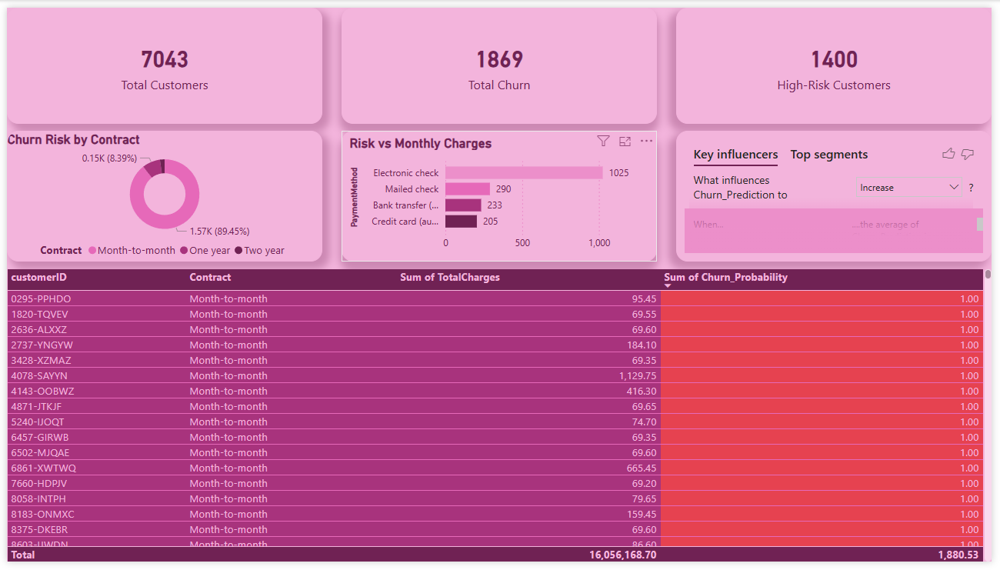

📱 Telco Customer Churn Prediction & Retention Dashboard

📋 Project Overview
Proyek ini bertujuan untuk memprediksi probabilitas pelanggan berhenti berlangganan (churn) pada perusahaan telekomunikasi menggunakan Machine Learning. Berbeda dengan analisis deskriptif biasa, proyek ini berfokus pada Analisis Prediktif untuk menghasilkan daftar prioritas pelanggan berisiko tinggi (High-Risk Customers) sehingga tim retensi dapat melakukan tindakan pencegahan secara proaktif.

🚀 Key Features & Workflow
1. Data Pipeline & Machine Learning (Python)
Exploratory Data Analysis (EDA): Mengidentifikasi korelasi antara jenis kontrak, metode pembayaran, dan biaya terhadap status churn.

Data Preprocessing: Melakukan konversi tipe data numerik pada TotalCharges, menangani missing values, dan menghapus fitur non-prediktif seperti customerID untuk pemrosesan model.

Feature Engineering: Menggunakan One-Hot Encoding untuk mengubah data kategorikal menjadi format biner agar dapat diproses oleh algoritma.

Predictive Modeling: Mengembangkan model Random Forest Classifier dengan tingkat akurasi ~78%.

2. Database Integration (PostgreSQL)
Automation: Menggunakan SQLAlchemy dan driver pg8000 untuk mengotomatisasi pengiriman data hasil prediksi dari Python ke database.

Single Source of Truth: Menyimpan hasil prediksi akhir di tabel churn_predictions_results sebagai sumber data tunggal untuk kebutuhan laporan bisnis.

3. Business Intelligence Dashboard (Power BI)
Dashboard dirancang untuk bersifat Action-Oriented (berorientasi pada tindakan):

Churn Risk Monitor: Menampilkan daftar prioritas pelanggan berisiko tinggi. Saat ini terdeteksi 1.400 High-Risk Customers.

AI-Powered Insights: Visualisasi Key Influencers yang secara otomatis menemukan bahwa jenis kontrak Month-to-month memiliki risiko churn paling tinggi (89.45%).

Operational Action Table: Tabel dinamis yang menyertakan skor Churn_Probability (skala 0.0 - 1.0) untuk membantu tim operasional menentukan prioritas intervensi.

🛠️ Tech Stack
Language: Python (Pandas, Scikit-Learn, SQLAlchemy, Joblib).

Database: PostgreSQL (pg8000).

Tool: Power BI Desktop.

Dataset: [Telco Customer Churn Dataset (Kaggle)](https://www.kaggle.com/datasets/blastchar/telco-customer-churn)

📊 Dashboard Visualization

Dashboard operasional yang menunjukkan daftar pelanggan dengan skor probabilitas churn tertinggi (warna merah).

📈 Business Impact
Melalui solusi ini, perusahaan dapat:

Optimasi Budget: Mengurangi pemborosan biaya pemasaran dengan hanya memberikan promo kepada pelanggan yang benar-benar berisiko tinggi sesuai prediksi model.

Strategi Retensi: Memperbaiki strategi pada segmen pembayaran Electronic Check dan kontrak bulanan yang teridentifikasi memiliki tingkat churn tertinggi.

